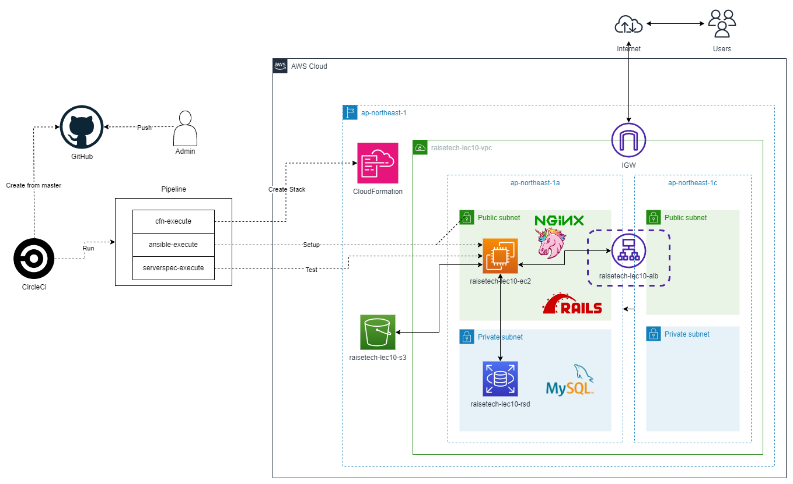

# RaiseTech AWSコース

## 課題内容（※講義のみの回は除外）

|講座|課題内容|課題報告ファイル|
|---|---|---|
|**第2回**|GitHubアカウント作成と初期設定を行いブランチ作成後、今課題での学びをmdファイルに書いてプルリク|[lecture02.md](./lecture02.md)|
|**第3回**|Cloud9で[サンプルアプリーケーション](https://github.com/yuta-ushijima/raisetech-live8-sample-app.git)のデプロイ後ブラウザ表示。APサーバー、DBサーバー、Railsの構成管理ツール|[lecture03.md](./lecture03/lecture03.md)|
|**第4回**|マネージメントコンソールでVPC、EC2、RDSの環境構築を行いEC2からRDSの接続|[lecture04.md](./lecture04/lecture04.md)|
|**第5回**|1.第4回課題の環境に[サンプルアプリーケーション](https://github.com/yuta-ushijima/raisetech-live8-sample-app.git)のデプロイし組み込みサーバー(Puma)で起動確認 2.Webサーバー(Nginx)とAPサーバー(Unicorn)で起動確認 3.ALBとS3(アプリケーションの画像の保存先)を追加 4.構成図の作成|[lecture05.md](./lecture05/lecture05.md)|
|**第6回**|1.CloudTrailでイベント確認  CloudWatchアラームでALBのアラームのメール通知設定(Amazon SNS) / AWS利用料の見積もり作成(pricing calculator)|[lecture06.md](./lecture06/lecture06.md)|
|**第10回**|CloudFormationで環境構築|[lecture10.md](./lecture10/lecture10.md)|
|**第11回**|ServerSpecの[サンプルコード](https://github.com/MasatoshiMizumoto/raisetech_documents/tree/main/aws/samples/serverspec)でテスト実行|[lecture11.md](./lecture11/lecture11.md)|
|**第12回**|CircleCIの[サンプルコンフィグ](https://github.com/MasatoshiMizumoto/raisetech_documents/tree/main/aws/samples/circleci)の組み込んで成功することを確認|[lecture12.md](./lecture12/lecture12.md)|
|**第13回**|第12回のCircleCIを拡張してServerSpecやAnsibleの処理を追加して成功を確認|[lecture13.md](./lecture13/lecture13.md)|
|**第14回**|AWS構成図、自動化処理がわかる図、リポジトリの README作成|[lecture14.md](./lecture14/lecture14.md)|

## 第13回課題完成後の構成図

