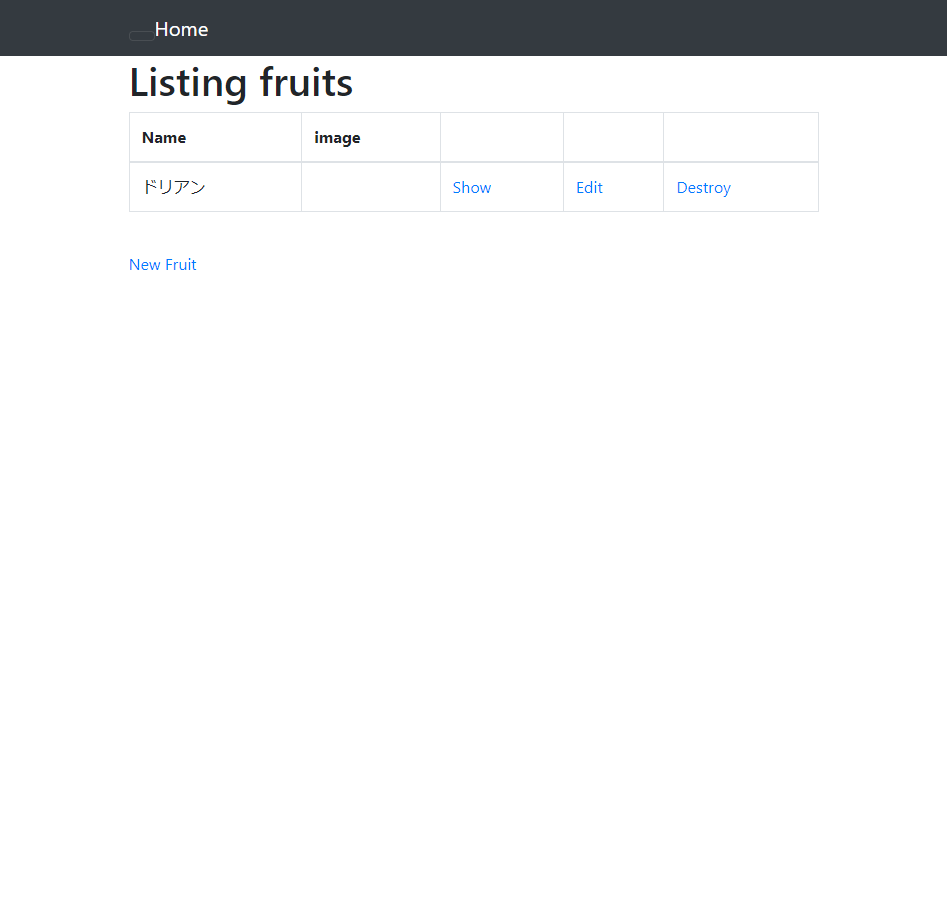
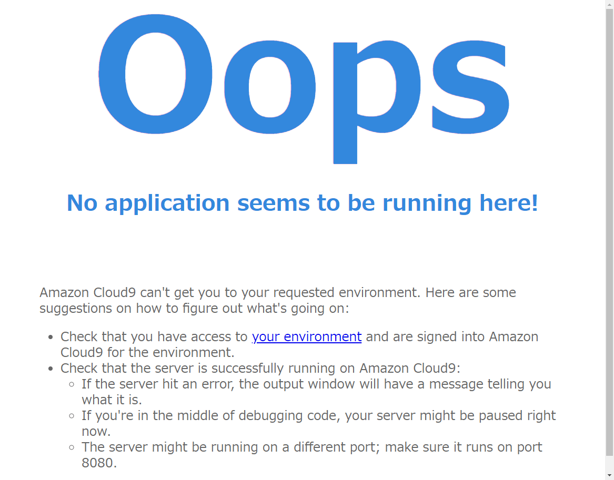
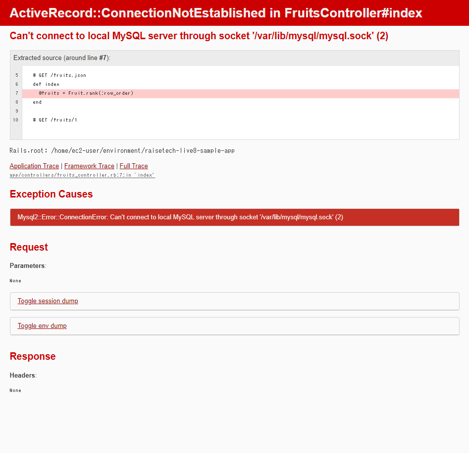
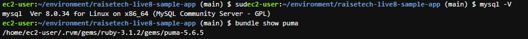

# 第三回課題

## サンプルアプリケーションの起動・アクセス

## APサーバーについて
- **サーバー名**: puma
- **バージョン**: 5.6.5
- APサーバーを終了させた場合: アクセス不可

## DBサーバーについて
- **DB エンジン名**: mysql
- **バージョン**: 8.0.34
- DBサーバーを終了させた場合: アクセス不可

## Railsの構成管理ツール名
- Bundler

## 課題から学んだこと
- Webアプリケーションの基礎
- GemとBundlerの基礎と使い方
- APサーバーとDBサーバーがどのような働きをしているのか
- システム開発の流れ
