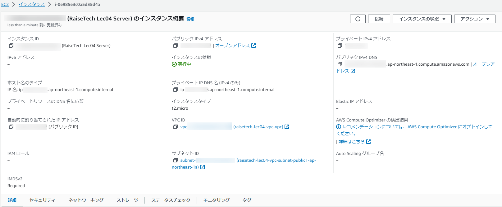
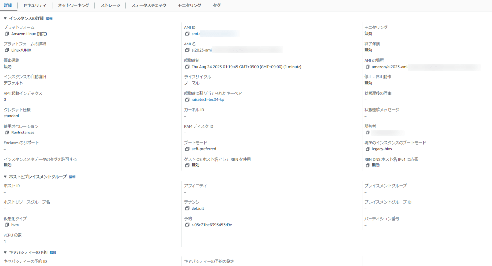
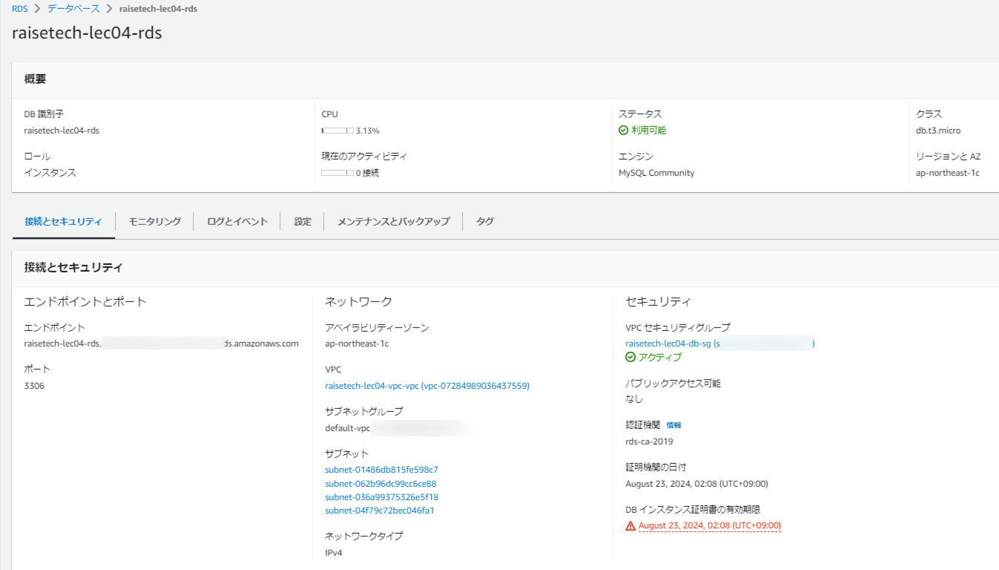
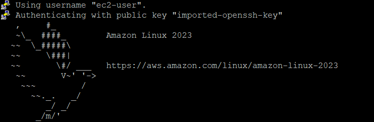
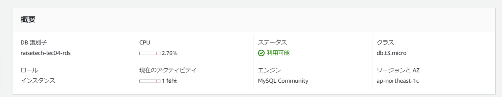

## 第四回課題

# 1. VPC作成

VPCをAWS上で作成しました。

# 2. EC2インスタンスの作成

以下のステップでEC2インスタンスを作成しました。

- **初期画面**
  

- **詳細設定画面**
  

# 3. RDSの作成

RDSインスタンスも作成完了しました。

- **初期設定画面**
  

- **詳細設定画面**
  

# 4. EC2からRDSへの接続

Puttyを使用して、EC2からRDSへの接続を確立しました。

- **EC2への接続画面**
  

- **MySQL接続後RDSへの接続画面**
  

接続後のRDSコンソールの状況は以下の通りです。

- **接続後のRDSコンソール画面**
  
