# 第五回課題
***
## EC2上にサンプルアプリケーションのデプロイして動作させる

## 1.組み込みサーバー

- puma起動時ターミナル

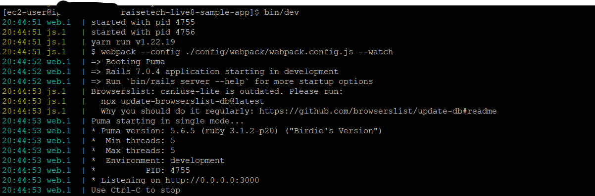

- ブラウザ

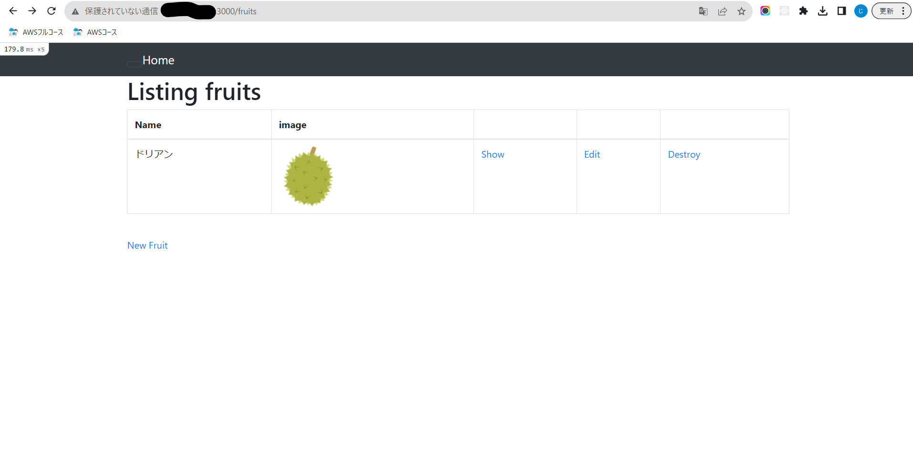

## 2.Webサーバー（Nginx）とアプリケーションサーバー（Unicorn）

- NginxとUnicorn起動時ターミナル

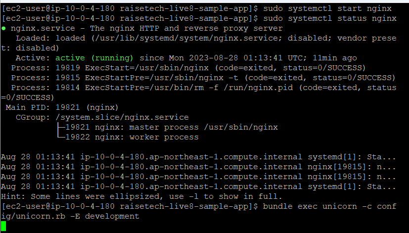

- ブラウザ

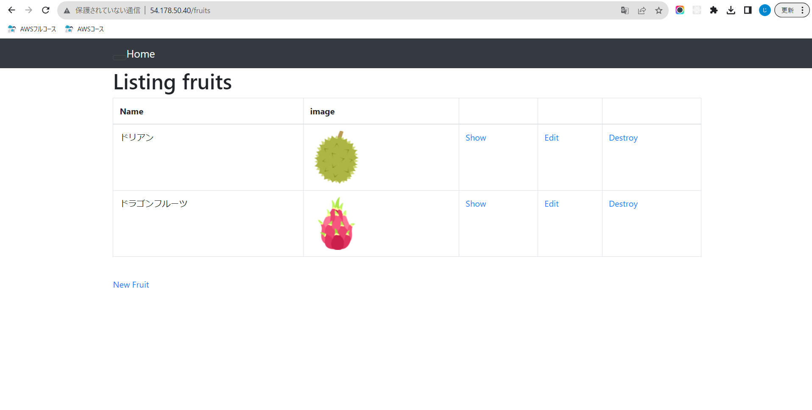

## ELB(ALB)を追加

- ターゲットグループ作成

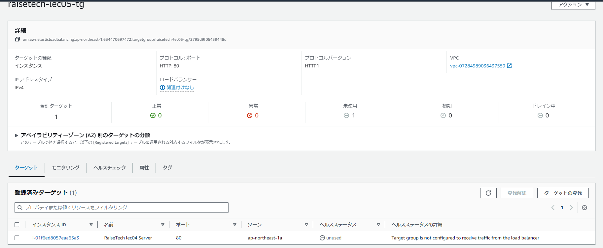

- ALB作成

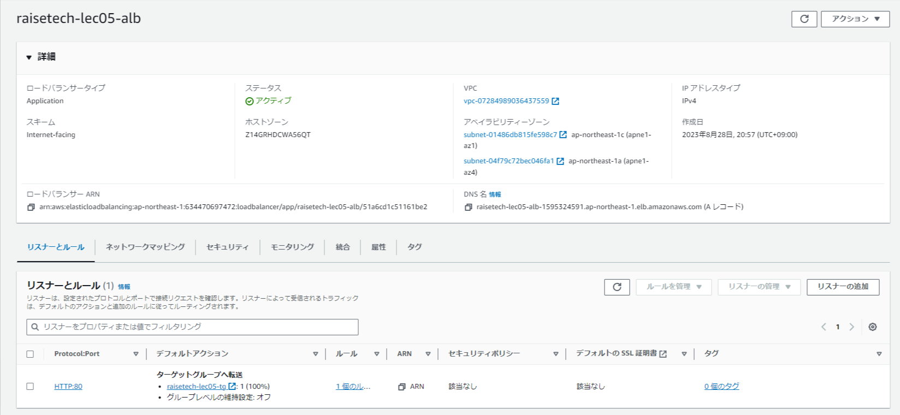

- ALBインバウンドルール

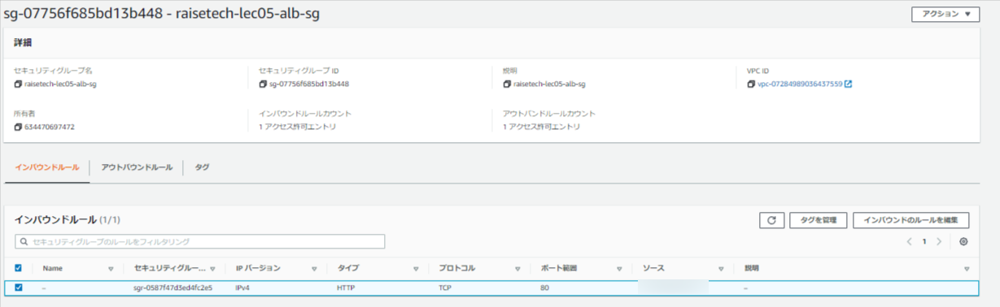

- ALBアウトバウンドルール

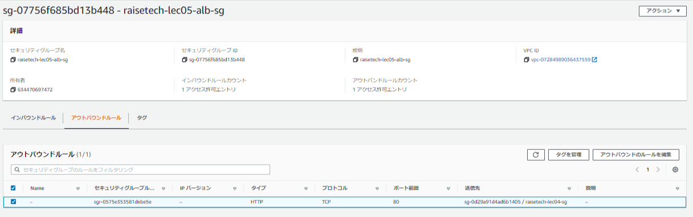

- EC2セキュリティグループでALBをインバウンドルールに追加

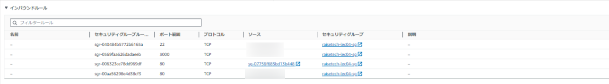

- 疎通確認

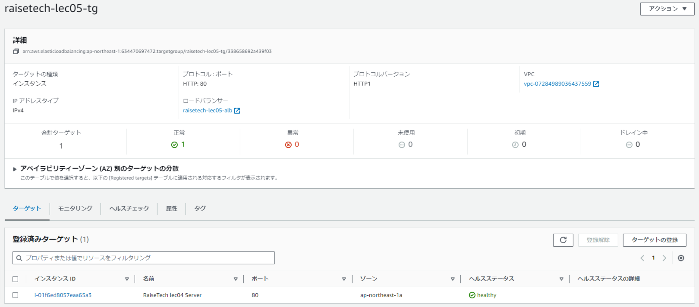

- ALB追加後ブラウザ画面

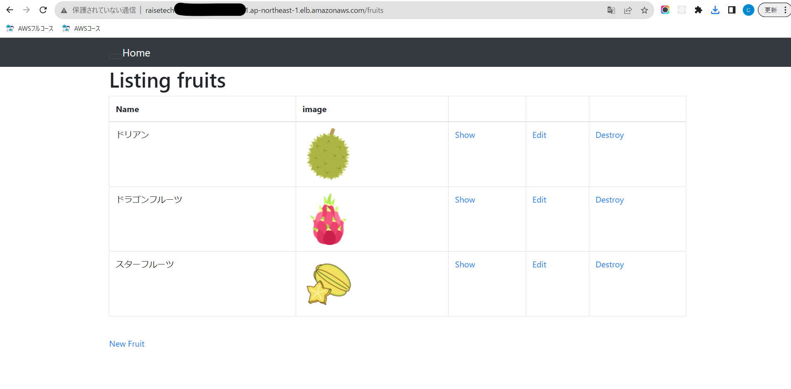

## S3を追加

- IAMロールをEC2に紐づけて作成

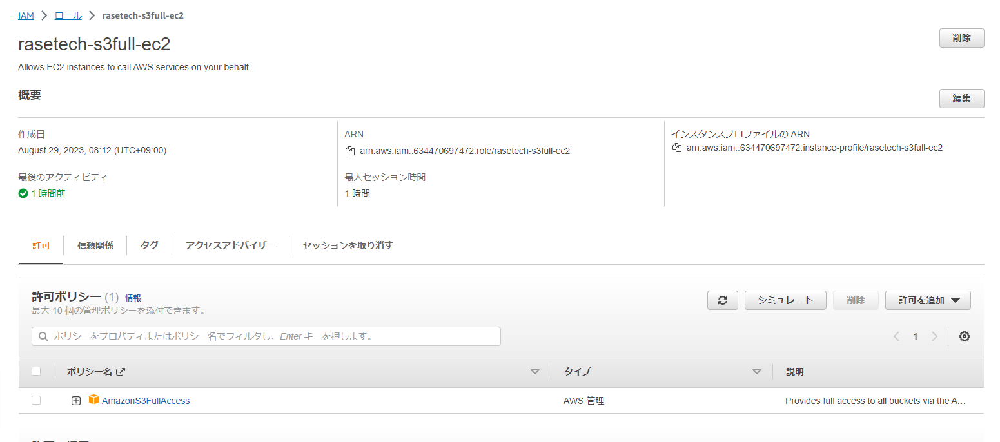

- EC2のコンソールでロール確認

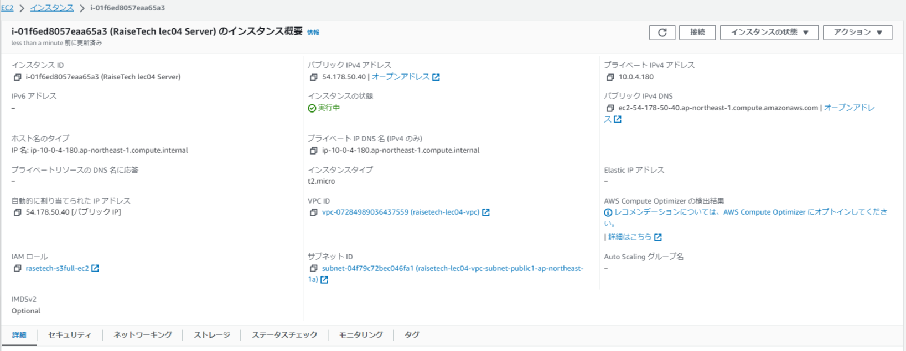

- S3追加後ブラウザ画面

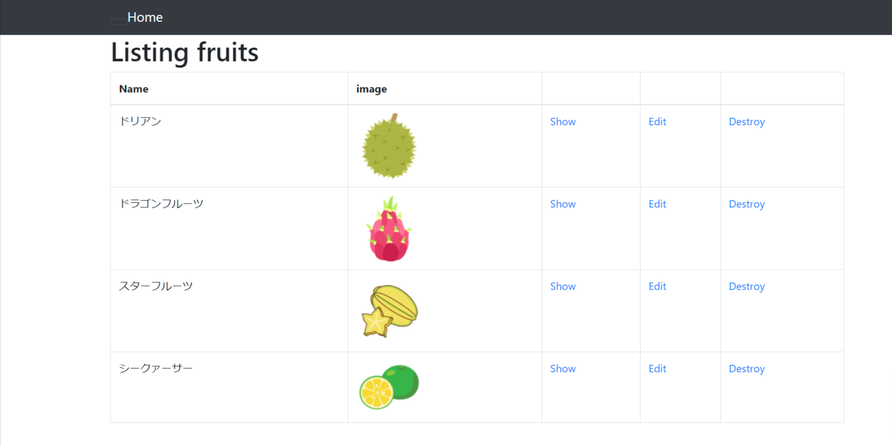

- S3追加後コンソール画面

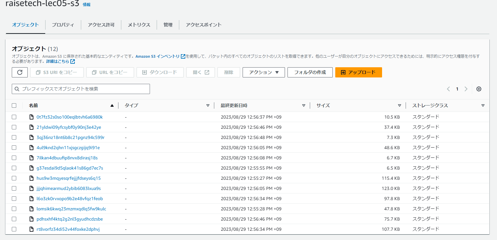

## 構成図

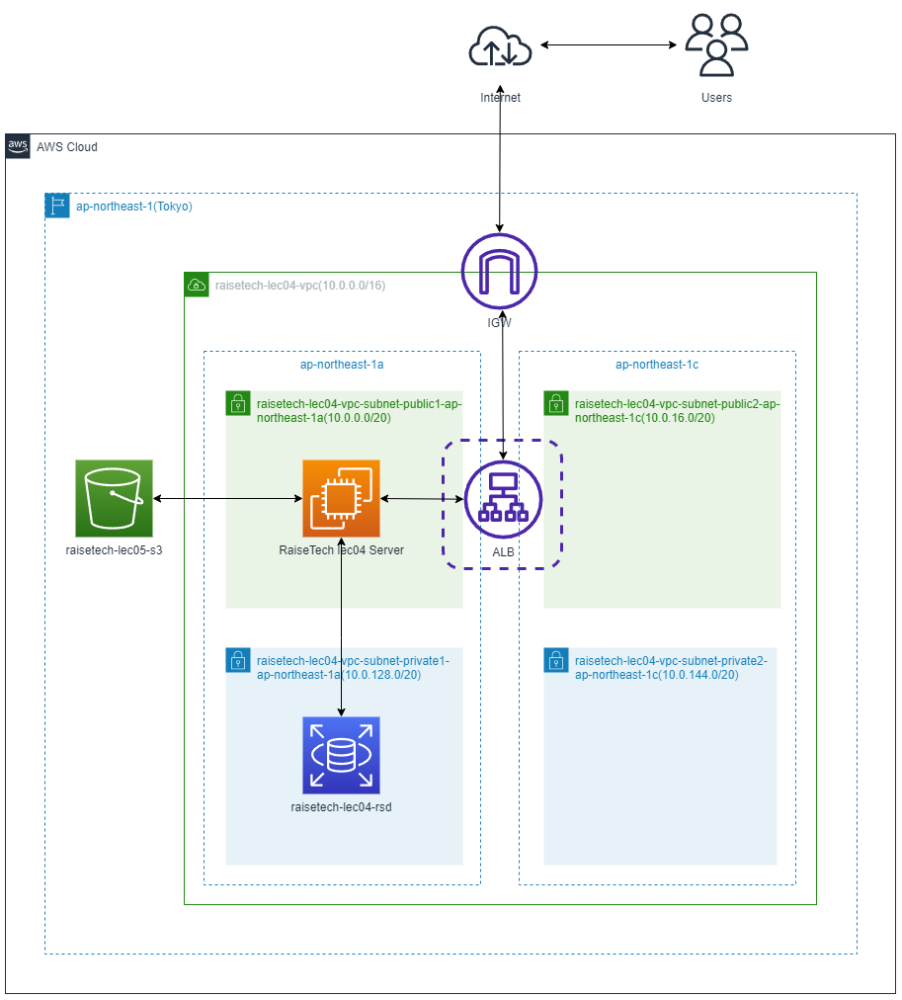
