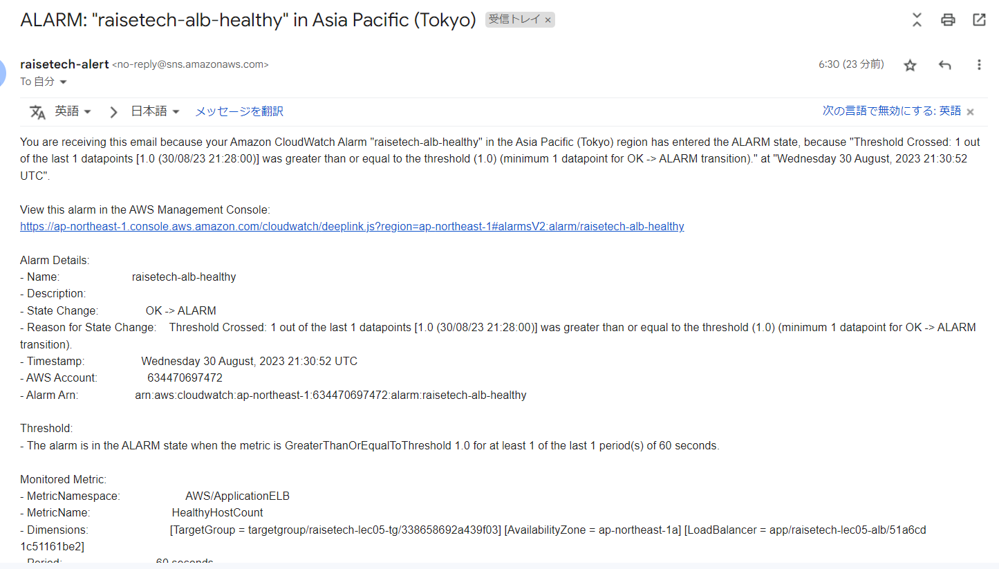

# 第六回課題
***
## 1.最後にAWSを利用した日の記録をCloudTrailのイベントから探す。イベント名と情報を3つピックアップする

- **イベント名** : ConsoleLogin

- イベント時間 : August 31, 2023, 04:19:40 (UTC+09:00)

- ユーザー名 : RaiseTech

- イベントソース : signin.amazonaws.com

## 2.CloudWatchアラームを使ってALB のアラームを設定してメール通知

- helthy詳細

- unhealthy詳細

- helthyアラーム確認

- helthyアラーム時メール通知

- unhelthyアラーム確認

- unhelthyアラーム時メール通知

## 3.AWS 利用料の見積を作成

[見積もりはこちら](https://calculator.aws/#/estimate?id=7143cb356e5e30a3a79e69673ca01c968a818ef4)

-請求額(今月中旬に契約したので今月分です)

