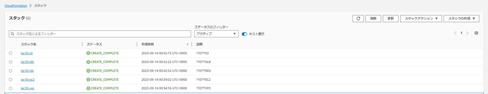
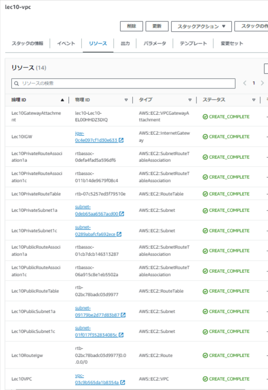
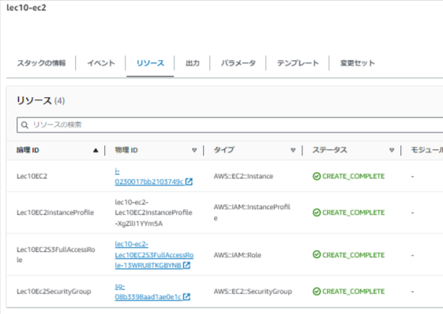
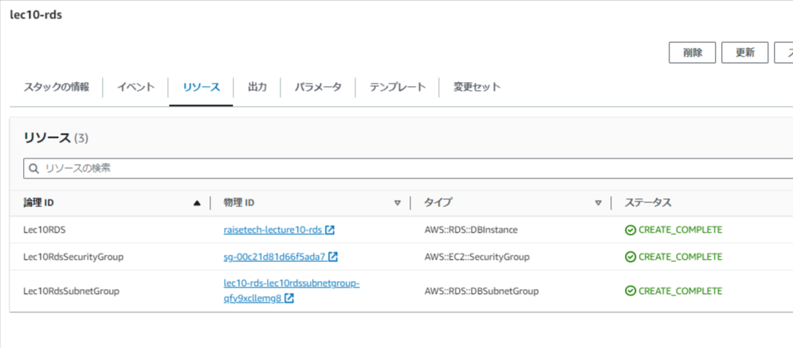
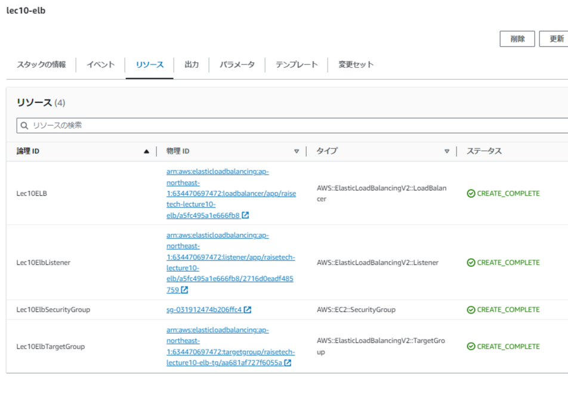
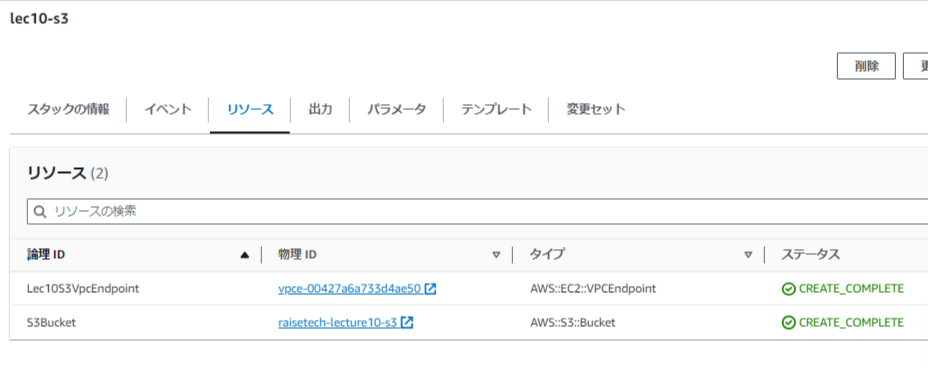

# 第10回課題

## CloudFormation を利用して、現在までに作った環境をコード化する。また、コード化ができたら実行してみて、環境が自動で作られることを確認する。

***

## 1.コードは下記にファイルで作成

 - [vpc.yml](./templates/vpc.yml)
 - [ec2.yml](./templates/ec2.yml)
 - [rds.yml](./templates/rds.yml)
 - [elb.yml](./templates/elb.yml)
 - [s3.yml](./templates/s3.yml)

## 2.実行後の確認画像

  - **一覧**

  

  - **VPCリソース**

  

  - **EC2リソース**

  

  - **RDSリソース**

  

  - **ELBリソース**

  

  - **S3リソース**

  
