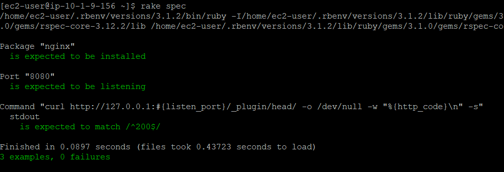

# 第11回課題

## ServerSpec のテストが成功することを追加課題とします。

- サンプルを提供しますので、本日の授業を参考にカスタマイズしてみてください。
- テスト定義には決まった答えはないので、自由な発想で色々試してみましょう。

## 環境構築

- ruby,rbenv,ruby-buildをインストール
- serverspecインストールと初期化
- spec/localhost/sample_spec.rbを書き換え
- nginxのインストール
- nginxがポート8080でリッスンするように/etc/nginx/nginx.d配下に設定ファイルを作成

```
server {
  listen 8080;
  server_name localhost;
}
```
- nginxをリロードもしくは再起動
- rake specコマンドでテスト実行

## 実行結果


