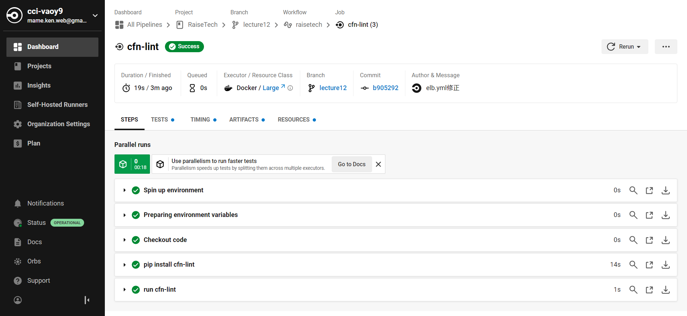

# 第13回課題

## CircleCI のサンプルにServerSpecやAnsibleの処理を追加してください。

- circleciでアカウント作成しgithubのリポジトリと接続
- fast選択すると自動でcircleci-project-setupブランチが出来て.circleci/config.ymlが作成される
- そこからブランチを切って.circleci/config.ymlを修正。またcloudformationフォルダを作成しその配下に必要なymlファイルを配置。
- jobの実行

# **job実行後circleciのUI**

