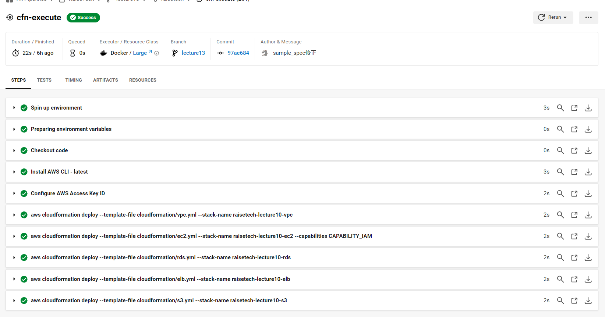
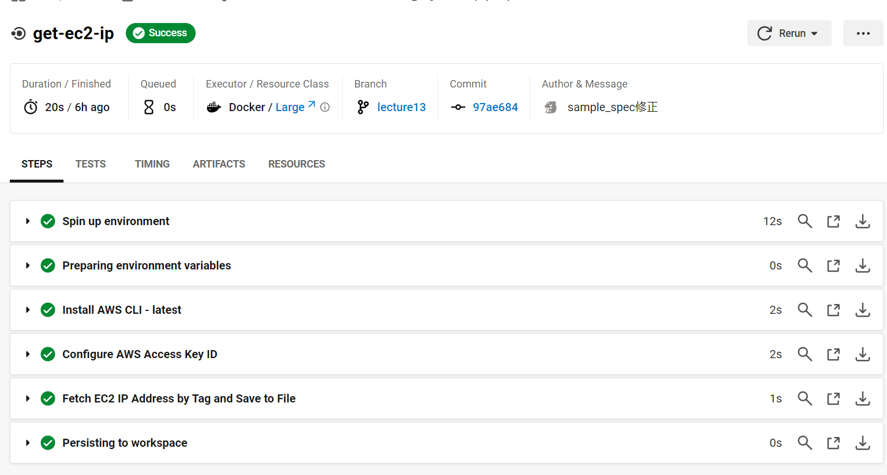
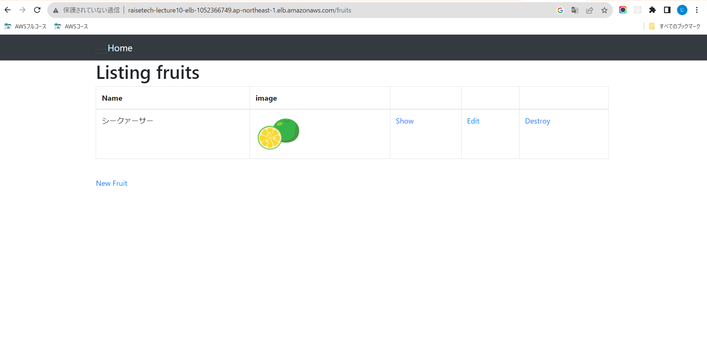

# 第13回課題

## CircleCI のサンプルに ServerSpec や Ansible の処理を追加してください。
## やったこと
- ルートディレクトリにansibleとserverspecフォルダを作成し必要なファイルを作成
- cloudformationやcircleciのコードも追記修正

## 参考
- Ansibleの実行時に-vvvオプションを追加することで、より詳細なデバッグ情報を取得できる。これにより、問題の原因を特定しやすくなる。
- Cannot find a valid baseurl for repo: amzn2-core/2/x86_64 のエラーが表示される原因について。Amazon Linux 2 の yum リポジトリにアクセスが出来ない為にエラーとなっています。Amazon Linux 2 の yum リポジトリは、S3 にあり、AWS の内部からしかアクセスが許可されていない。その為、VPC のエンドポイントの設定をして、S3 にある yum リポジトリにアクセスできるようにしてないとエラーとなる。
- 必要時CircleCiの環境変数を作成
- CircleCiのconfig.ymlで変数はworkspaceや$BASH_ENVで扱う

## 参照するコード

以下のリンクから各部分のコードを参照してください:

- **CloudFormation**: [リンク](../cloudformation)
- **CircleCI**: [リンク](../.circleci)
- **Ansible**: [リンク](../ansible)
- **ServerSpec**: [リンク](../serverspec)

## プッシュ後のCircleCIでサクセスの確認

- **pipline**

- **cfn-lint**

- **cfn-execute**

- **get-ec2-ip**

- **get-rds-endpoint**

- **ansible-execute**

- **serverspec-execute**

- **ALB経由でアプリ起動**

